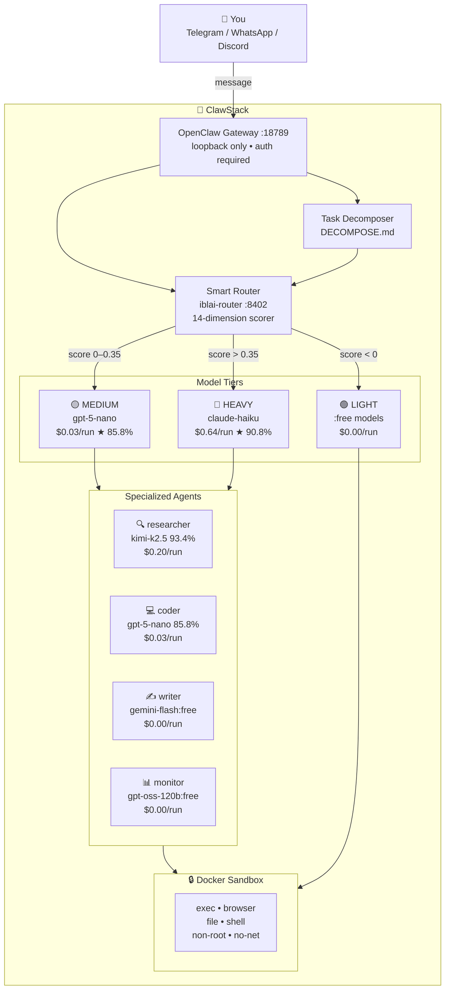
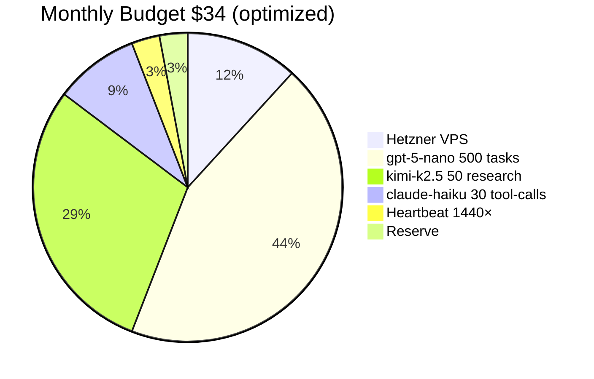
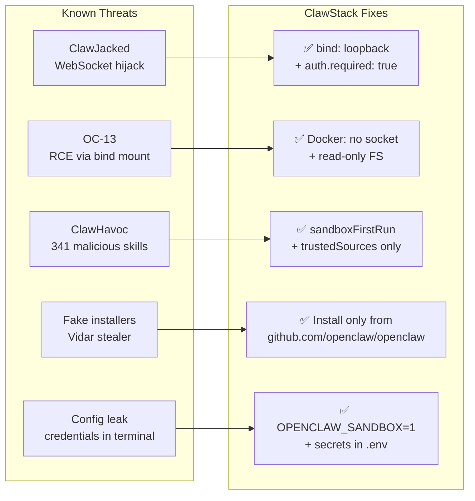
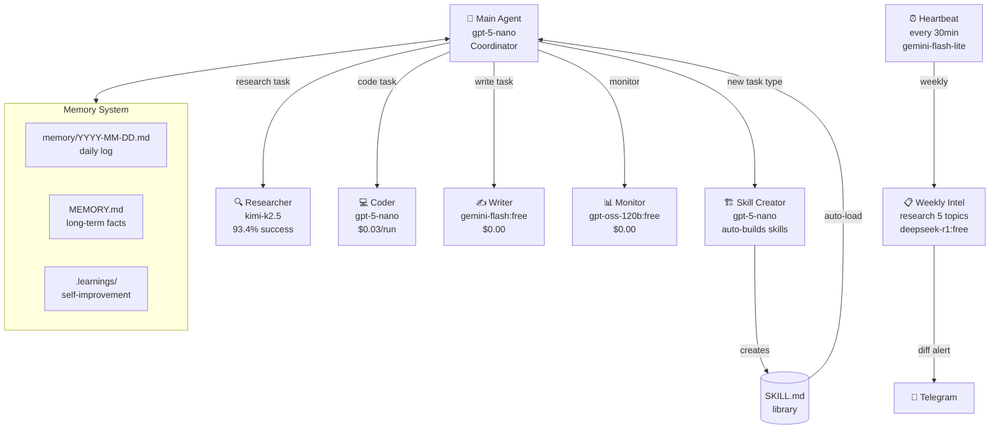
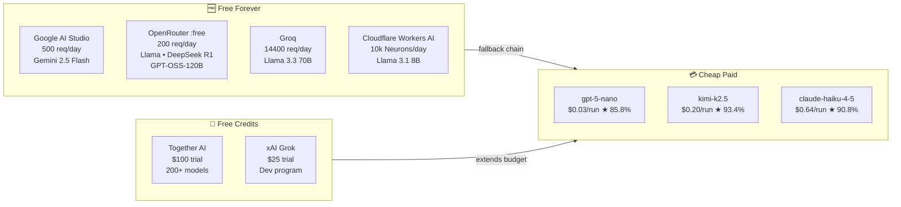
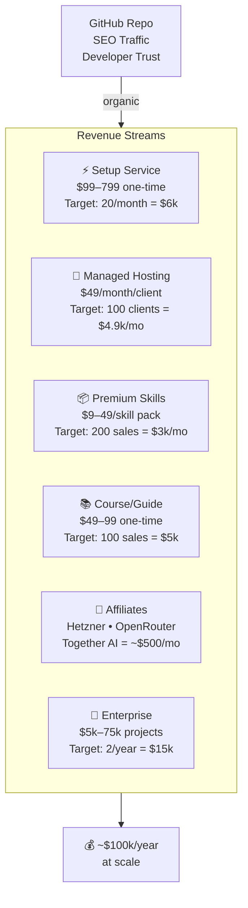
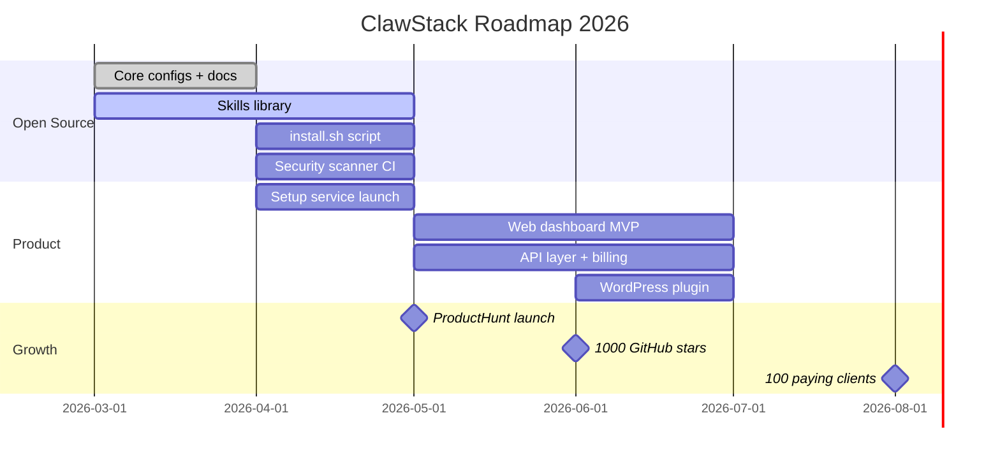

# 🦞 ClawStack — OpenClaw Cost Optimizer & Deployment Toolkit

> **Cut your OpenClaw costs by 80% in 15 minutes.**
> Production-ready configs, smart model routing, security hardening, and automated setup — for solo developers, teams, and businesses running AI agents on a budget.

[](LICENSE)
[](https://github.com/openclaw/openclaw)
[](https://github.com/YOUR_USERNAME/clawstack)
[](https://pinchbench.com)
[](docs/security.md)

**→ [Quick Start](#-quick-start-15-minutes) · [Cost Calculator](#-cost-calculator) · [Docs](docs/) · [Setup Service](#-professional-setup-service)**

---

## 📊 Why ClawStack?

Most OpenClaw deployments use a single expensive model for everything — heartbeats, simple replies, complex analysis — the same way. That's like driving a Ferrari to buy groceries.

| Setup | Monthly Cost | Performance |
|-------|-------------|-------------|
| Default OpenClaw (Claude Sonnet) | $50–200 | 92.7% |
| **ClawStack (smart routing)** | **$13–34** | **91–93%** |
| Managed services (ClickClaw etc.) | $19–49 | 85–90% |
| Self-hosted, unoptimized | $6–50 | varies |

**ClawStack routes each task to the cheapest capable model automatically.**  
Based on [PinchBench](https://pinchbench.com) — the OpenClaw-specific LLM benchmark (23 real agent tasks, Claude Opus judge).

---

## 🗺️ Architecture



---

## 🏗️ Repository Structure

```
clawstack/
├── README.md                    # this file
├── LICENSE                      # MIT
├── CHANGELOG.md                 # version history
│
├── configs/                     # ready-to-use openclaw.json configs
│   ├── openclaw-budget.json     # $13/month setup (recommended)
│   ├── openclaw-free.json       # $0/month (Oracle + :free models)
│   ├── openclaw-team.json       # $34/month multi-agent setup
│   └── openclaw-enterprise.json # $50/month maximum config
│
├── workspace/                   # drop-in workspace files
│   ├── SOUL.md                  # agent personality + cost rules
│   ├── AGENTS.md                # team delegation rules
│   ├── HEARTBEAT.md             # background tasks scheduler
│   ├── COST_RULES.md            # token economy rules
│   ├── DECOMPOSE.md             # task decomposition protocol
│   ├── CONTRADICTION.md         # contra-check module
│   ├── PROJECTS.md              # project tracking template
│   └── USER.md                  # user profile template
│
├── skills/                      # custom skills
│   ├── weekly-intel/            # automated weekly research
│   │   └── SKILL.md
│   ├── cost-monitor/            # spending alerts
│   │   └── SKILL.md
│   ├── self-improving/          # learn from corrections
│   │   └── SKILL.md
│   └── morning-brief/           # daily briefing
│       └── SKILL.md
│
├── docker/                      # sandbox configs
│   ├── docker-compose.yml       # production (Tailscale + gVisor)
│   ├── docker-compose.simple.yml # simple local setup
│   └── Dockerfile               # hardened image
│
├── scripts/                     # automation scripts
│   ├── install.sh               # one-line installer
│   ├── setup-vps.sh             # Hetzner/DigitalOcean setup
│   ├── setup-oracle-free.sh     # Oracle Cloud free tier setup
│   ├── check-costs.sh           # OpenRouter/Anthropic cost check
│   └── security-scan.sh         # audit script
│
├── router/                      # smart model router
│   ├── README.md                # how to use iblai-router
│   └── router-config.json       # routing rules + thresholds
│
├── api/                         # your own API layer
│   ├── main.py                  # FastAPI gateway
│   ├── models.py                # Pydantic models
│   ├── auth.py                  # API key auth
│   ├── billing.py               # Stripe integration
│   ├── requirements.txt
│   └── Dockerfile
│
├── frontend/                    # web dashboard
│   ├── README.md
│   └── (Next.js app — см. docs/frontend.md)
│
├── docs/                        # documentation
│   ├── quick-start.md
│   ├── security.md              # CVE list, hardening guide
│   ├── models.md                # model comparison + PinchBench data
│   ├── budget-calculator.md     # cost breakdown
│   ├── gws-setup.md             # Google Workspace CLI setup
│   ├── docker-sandbox.md        # sandbox hardening
│   ├── api-providers.md         # all free/cheap API providers
│   ├── business-model.md        # monetization guide
│   ├── frontend.md              # frontend setup
│   └── faq.md
│
└── .github/
    ├── ISSUE_TEMPLATE/
    │   ├── bug_report.md
    │   └── feature_request.md
    └── workflows/
        ├── security-scan.yml    # weekly CVE check
        └── cost-report.yml      # monthly cost report
```

---

## ⚡ Quick Start (15 minutes)

### Option A — One-line installer
```bash
curl -fsSL https://raw.githubusercontent.com/YOUR_USERNAME/clawstack/main/scripts/install.sh | bash
```

### Option B — Manual
```bash
# 1. Prerequisites
node --version   # need >= 22.12.0
docker --version # need >= 29.0

# 2. Install OpenClaw (official only)
npm install -g openclaw@latest
openclaw --version  # check >= 2026.3.2

# 3. Clone ClawStack
git clone https://github.com/YOUR_USERNAME/clawstack
cd clawstack

# 4. Copy your preferred config
cp configs/openclaw-budget.json ~/.openclaw/openclaw.json

# 5. Set up environment
cp .env.example ~/.openclaw/.env
nano ~/.openclaw/.env  # fill in API keys
chmod 600 ~/.openclaw/.env

# 6. Copy workspace files
cp -r workspace/* ~/.openclaw/workspace/
cp -r skills/*    ~/.openclaw/workspace/skills/

# 7. (Optional) Start smart router
git clone https://github.com/iblai/iblai-openclaw-router
cd iblai-openclaw-router && node server.js &

# 8. Google Workspace CLI
npm install -g @googleworkspace/cli
gws auth setup && gws auth login

# 9. Validate & launch
openclaw config validate --json
openclaw doctor --fix
openclaw onboard --install-daemon
openclaw channels login   # Telegram: create bot via @BotFather

# 10. Test
# Message your bot: "Hello! What's your version?"
```

---

## 💰 Cost Calculator

### PinchBench-calibrated model selection

Based on [PinchBench](https://pinchbench.com) — 23 real OpenClaw tasks, scored by Claude Opus.

| Task Type | Recommended Model | Score | Cost/run | Notes |
|-----------|------------------|-------|----------|-------|
| Greeting, simple Q&A | `gpt-oss-120b:free` | ~75% | $0.00 | :free via OpenRouter |
| Research, web search | `kimi-k2.5` | 93.4% | $0.20 | Best value for research |
| Code generation | `gpt-5-nano` | 85.8% | $0.03 | 20× cheaper than Haiku |
| Tool-calling, agents | `claude-haiku-4-5` | 90.8% | $0.64 | Best for tool chains |
| Complex analysis | `claude-sonnet-4-5` | 92.7% | $3.07 | Use sparingly |
| Heartbeat checks | `gemini-2.5-flash-lite` | 76% | $0.05 | Reliable, cheap |

### ❌ Do NOT use for agents (poor value)
| Model | Score | Cost/run | Problem |
|-------|-------|----------|---------|
| `grok-4.1-fast` | 70.0% | $0.24 | Lowest score / highest ratio cost |
| `qwen3-max-thinking` | 40.9% | $0.00 | 40% success rate is unusable |
| `claude-opus-4.6` | 90.6% | $5.89 | Worse than Sonnet, 2× pricier |
| `deepseek-v3.2` | 82.1% | $0.73 | OK for batch code, bad as agent |

### Monthly budget scenarios



| Scenario | Cost/month | Tasks/month | Stack |
|----------|-----------|-------------|-------|
| 🆓 Free tier | $0–3 | ~200/day | Oracle Free + Google AI Studio |
| 💚 Budget | $13–20 | ~300/day | Hetzner $4 + gpt-5-nano + :free |
| ⭐ Recommended | $28–35 | ~500/day | Budget + Kimi research + Haiku tools |
| 🚀 Power | $45–50 | ~1000/day | Recommended + Sonnet reserve |

---

## 🔐 Security

OpenClaw has documented CVEs. ClawStack ships with hardening by default.



**Minimum safe version: v2026.3.2**  
Full CVE list: [docs/security.md](docs/security.md)

### Security checklist (run after install)
```bash
openclaw doctor --fix
openclaw security audit --deep
openclaw config validate --json
chmod 600 ~/.openclaw/openclaw.json ~/.openclaw/.env
```

---

## 🧠 Multi-Agent Architecture



---

## 🔌 Integrations

### API Providers (free → paid)



### Google Workspace CLI (gws) — выпущен 06.03.2026

```bash
npm install -g @googleworkspace/cli
gws auth login -s gmail.readonly,calendar.readonly,drive.readonly
gws mcp --tool-mode compact  # 26 tools, MCP server for OpenClaw
```

Добавить в `openclaw.json`:
```json
"mcp": {
  "servers": [{
    "name": "google-workspace",
    "command": "gws",
    "args": ["mcp", "--tool-mode", "compact"]
  }]
}
```

⚠️ Не официальный продукт Google, но Apache-2.0, активно поддерживается.  
Полный гайд: [docs/gws-setup.md](docs/gws-setup.md)

---

## 🗂️ All Config Files

### configs/openclaw-budget.json (рекомендуемый)
→ [configs/openclaw-budget.json](configs/openclaw-budget.json)  
$13–20/мес · gpt-5-nano основной · kimi research · haiku tool-calling

### configs/openclaw-free.json
→ [configs/openclaw-free.json](configs/openclaw-free.json)  
$0–3/мес · Oracle Cloud Free · Google AI Studio · :free модели

### configs/openclaw-team.json
→ [configs/openclaw-team.json](configs/openclaw-team.json)  
$28–35/мес · 5 специализированных агентов · weekly intel · self-improvement

### configs/openclaw-enterprise.json
→ [configs/openclaw-enterprise.json](configs/openclaw-enterprise.json)  
$45–50/мес · максимальный функционал · secrets management · мониторинг

---

## 🐳 Docker Quick Deploy

```bash
# Simple (local)
docker compose -f docker/docker-compose.simple.yml up -d

# Production (Tailscale VPN, zero exposed ports)
TAILSCALE_AUTHKEY=your_key \
OPENCLAW_GATEWAY_SECRET=$(openssl rand -hex 32) \
docker compose -f docker/docker-compose.yml up -d
```

---

## 📅 Weekly Intel — Auto-Research Module

Каждое воскресенье в 03:00 агент сам исследует:
- Новые CVE и баги OpenClaw
- Новые бесплатные LLM API и модели
- Обновления конфига которые стоит применить
- Топ новых skills на ClawHub

Стоимость: ~$0.05–0.15/неделя (deepseek-r1:free)

```bash
openclaw cron add \
  --name "Weekly Intel" \
  --cron "0 3 * * 0" \
  --session isolated \
  --message "Run skill weekly-intel"
```

→ [skills/weekly-intel/SKILL.md](skills/weekly-intel/SKILL.md)

---

## 🛠️ Professional Setup Service

> **Don't want to configure it yourself? We'll do it for you.**

Managed OpenClaw setup eliminates 2–5 hours/month of maintenance — if your time is worth $50+/hour, even a $299 setup pays for itself in 2 months.

| Tier | Price | Includes | SLA |
|------|-------|----------|-----|
| **Starter** | $99 one-time | Config + workspace files + Telegram setup | 30-day email support |
| **Pro** | $299 one-time | Starter + Docker + VPS setup + 3 custom skills | 60-day support |
| **Business** | $799 one-time | Pro + API layer + dashboard + team setup | 90-day support + 1 call/month |
| **Managed** | $49/month | Everything + monitoring + updates + on-call | 99.9% uptime SLA |

**→ [Book setup](https://YOUR_DOMAIN/setup)** · Questions: setup@YOUR_DOMAIN

---

## 💼 Business Model & Revenue Paths

See full business plan: [docs/business-model.md](docs/business-model.md)



---

## 📡 Platform Distribution

ClawStack можно интегрировать в:

| Платформа | Метод | Монетизация |
|-----------|-------|-------------|
| **WordPress** | REST API plugin + WP block | Freemium plugin ($49/year) |
| **Ghost** | API integration + member tier | Subscriber-only content |
| **Webflow** | Embed + API calls | Lead gen → setup service |
| **Framer** | API component | Dashboard demo |
| **Telegram Mini App** | WebApp + Bot | Direct user acquisition |
| **ProductHunt** | Launch → traffic spike | One-time boost |
| **GitHub Marketplace** | Action для CI/CD | B2B leads |

WordPress plugin MVP:
```php
// Минимальный WP plugin — отправляет POST в ваш API
add_action('rest_api_init', function() {
    register_rest_route('clawstack/v1', '/chat', [
        'methods'  => 'POST',
        'callback' => 'clawstack_chat_handler',
        'permission_callback' => '__return_true'
    ]);
});
```

---

## 🗺️ Roadmap



---

## 📖 Documentation

| Doc | Description |
|-----|-------------|
| [Quick Start](docs/quick-start.md) | 15-minute setup guide |
| [Security Guide](docs/security.md) | CVE list, hardening, checklist |
| [Model Comparison](docs/models.md) | PinchBench data, cost/performance |
| [Budget Calculator](docs/budget-calculator.md) | Real cost scenarios |
| [Google Workspace Setup](docs/gws-setup.md) | gws CLI full guide |
| [Docker Sandbox](docs/docker-sandbox.md) | Isolation, gVisor, Tailscale |
| [API Providers](docs/api-providers.md) | All free/cheap providers |
| [Build Your API](docs/own-api.md) | FastAPI layer + Stripe billing |
| [Frontend](docs/frontend.md) | Next.js dashboard |
| [Business Model](docs/business-model.md) | Revenue paths to $100k/year |
| [FAQ](docs/faq.md) | Common questions |

---

## 🤝 Contributing

```bash
git clone https://github.com/YOUR_USERNAME/clawstack
cd clawstack
# Open an issue for bugs or features
# PRs welcome — especially new skills and provider configs
```

**Wanted contributions:**
- New skill SKILL.md files
- Provider configs (302.ai, Together AI, Groq)
- Security improvements
- Translations (RU, ZH, ES, DE)

---

## ⚖️ Comparison

| Feature | ClawStack | ClickClaw | Emergent | BetterClaw |
|---------|-----------|-----------|----------|------------|
| Open source | ✅ MIT | ❌ | ❌ | ❌ |
| Self-hosted | ✅ | ✅ | ❌ cloud | ✅ |
| Smart routing | ✅ 14-dim | ❌ | ❌ | ❌ |
| PinchBench optimized | ✅ | ❌ | ❌ | ❌ |
| Docker sandbox | ✅ | ✅ | ✅ | ✅ |
| Weekly auto-research | ✅ | ❌ | ❌ | ❌ |
| gws CLI integration | ✅ | ❌ | ❌ | ❌ |
| Cost/month (typical) | **$13–34** | $20+ | $19+ | $19+ |
| Setup time | 15 min | 2 min | 2 min | 5 min |

---

## 🔗 Useful Links

- [OpenClaw Official](https://github.com/openclaw/openclaw) — core project
- [OpenClaw Docs](https://docs.openclaw.ai) — official documentation
- [PinchBench](https://pinchbench.com) — model benchmark for OpenClaw
- [OpenRouter Free Models](https://openrouter.ai/collections/free-models) — free LLMs
- [Google AI Studio](https://aistudio.google.com) — 500 req/day free
- [Groq Console](https://console.groq.com) — 14400 req/day free
- [Together AI](https://api.together.ai) — $100 trial credits
- [gws CLI](https://github.com/googleworkspace/cli) — Google Workspace CLI
- [ClawHub](https://clawhub.ai) — community skills (verify before installing!)
- [iblai Router](https://github.com/iblai/iblai-openclaw-router) — smart router
- [Hetzner Cloud](https://hetzner.cloud/?ref=CLAWSTACK) — best budget VPS

---

## 📄 License

MIT © 2026 ClawStack Contributors

OpenClaw is MIT licensed by openclaw/openclaw.  
This project is not affiliated with OpenClaw, Anthropic, Google, or OpenAI.

---

<div align="center">

**⭐ Star this repo if it saved you money**  
**→ [Setup Service](https://YOUR_DOMAIN/setup) · [Discord](https://discord.gg/YOUR) · [Twitter](https://twitter.com/YOUR)**

</div>
